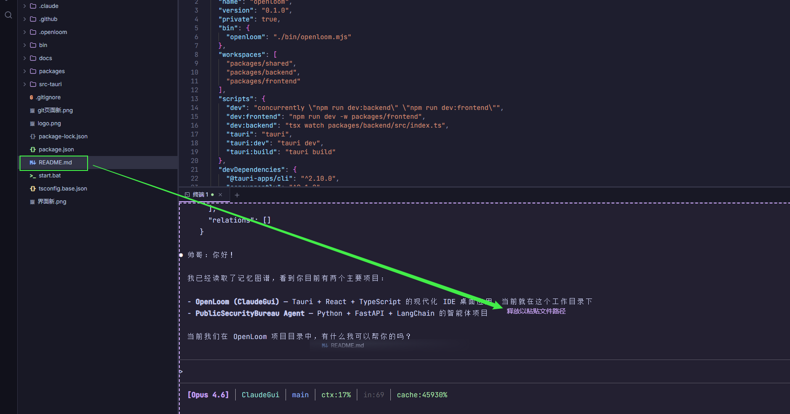
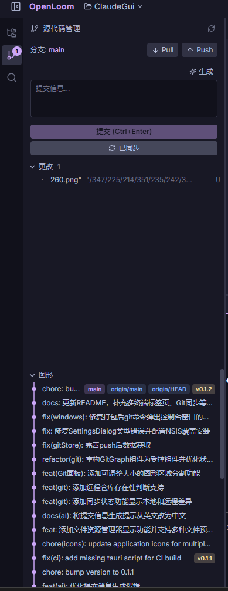
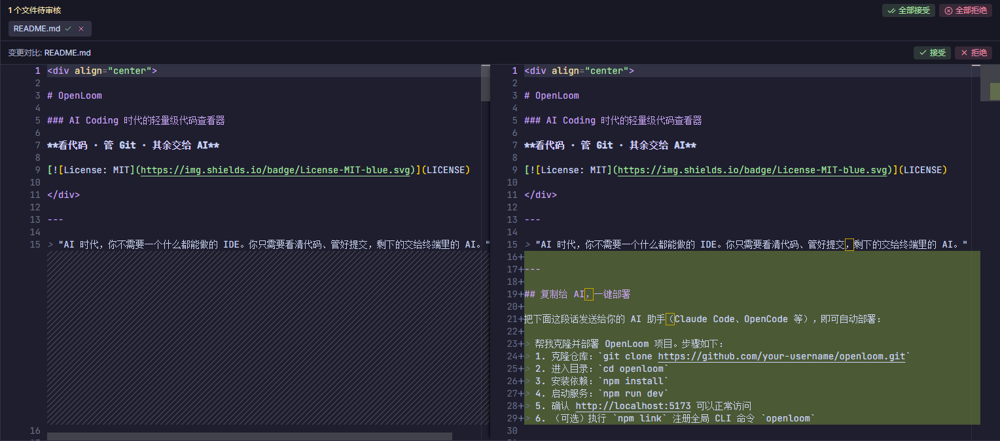

<div align="center">

# OpenLoom

### AI Coding 时代的轻量级桌面代码编辑器

**看代码 · 管 Git · 其余交给 AI**

[](LICENSE)

[下载 Windows](https://github.com/q198132/OpenLoom/releases/latest) ·
[下载 macOS](https://github.com/q198132/OpenLoom/releases/latest) ·
[下载 Linux](https://github.com/q198132/OpenLoom/releases/latest)

</div>

---

> "AI 时代，你不需要一个什么都能做的 IDE。你只需要看清代码、管好提交，剩下的交给终端里的 AI。"

---

## 下载安装

从 [GitHub Releases](https://github.com/q198132/OpenLoom/releases/latest) 下载对应平台的安装包：

| 平台 | 文件 |
|------|------|
| Windows | `OpenLoom_x.x.x_x64-setup.exe` 或 `.msi` |
| macOS (Apple Silicon) | `OpenLoom_x.x.x_aarch64.dmg` |
| macOS (Intel) | `OpenLoom_x.x.x_x64.dmg` |
| Linux | `.AppImage` 或 `.deb` |

下载后双击安装，打开即可使用，无需任何额外配置。

---

## 什么是 OpenLoom？

在 AI Coding 时代，Claude Code、OpenCode 等终端 AI 工具已经能帮你写代码、改 Bug、做重构。**你真正需要的不再是一个臃肿的全功能 IDE，而是一个轻量的界面来做两件事：看代码和管 Git。**

OpenLoom 就是为此而生的。

它是一个基于 **Tauri 2.0** 的**轻量级原生桌面应用**，Rust 后端 + React 前端，启动快、体积小、资源占用低。

### 与传统 IDE 的区别

| | VS Code / Cursor | OpenLoom |
|---|---|---|
| 定位 | 全功能 IDE | AI 时代的轻量伴侣 |
| 体积 | 数百 MB | ~10 MB |
| 运行方式 | Electron | Tauri 2.0（原生 WebView） |
| 写代码 | 手动编写 + AI 辅助 | 交给终端中的 AI |
| 你做什么 | 一切 | **看代码 + 管 Git** |

### 工作流

```
终端中的 AI（Claude Code / OpenCode）→ 写代码、改代码
OpenLoom                              → 看变更、审 Diff、提交 Git
```

你只需要打开 OpenLoom，观察 AI 在终端中实时修改的文件，审查 Diff，然后一键提交。

- **Monaco Editor** — 与 VS Code 同款编辑器引擎
- **内置终端** — 基于 xterm.js + portable-pty（Rust）的完整 PTY 终端，支持多标签页
- **文件树** — 右键菜单支持新建、重命名、删除，实时监听文件变更
- **Git 管理** — 状态、暂存、提交、Push/Pull/Sync、分支切换、提交历史图
- **全局搜索**（Ctrl+Shift+F）— 跨文件全文搜索
- **快速打开**（Ctrl+P）— 模糊匹配快速定位文件
- **Diff 审查** — 审查 AI 生成的代码变更后再接受
- **AI 提交信息** — 基于暂存区 diff 自动生成语义化 commit message
- **Catppuccin 主题** — Mocha（暗色）和 Latte（亮色）
- **工作区切换** — 多项目间无缝跳转

---

## 目录

- [下载安装](#下载安装)
- [功能特性](#功能特性)
- [快捷键](#快捷键)
- [技术栈](#技术栈)
- [从源码构建](#从源码构建)
- [项目结构](#项目结构)
- [更新日志](#更新日志)
- [参与贡献](#参与贡献)
- [许可证](#许可证)

---

## 功能特性


### 编辑器

OpenLoom 的核心。基于 **Monaco Editor**——与 VS Code 同款引擎。

- 支持 50+ 语言的语法高亮
- IntelliSense 智能补全
- 多标签页，支持未保存状态追踪
- Catppuccin Mocha（深色）和 Latte（浅色）主题
- Ctrl+S 保存

### 文件树

不只是查看器，更是完整的文件管理器。


- 右键菜单：**新建文件**、**新建文件夹**、**重命名**、**删除**
- 行内输入，无弹窗干扰
- 通过 Tauri 事件自动刷新外部文件变更
- 智能排序：文件夹优先，按字母排列

### 终端

真正的终端，通过 Rust `portable-pty` 提供完整 PTY 支持。

- **多终端标签页** — 同时运行多个终端实例，自由切换
- 基于 Tauri 事件的实时通信
- xterm.js + WebGL 渲染
- 自动适配面板大小
- 链接检测，可点击 URL
- **文件拖拽到终端** — 从文件树拖拽文件到终端，自动粘贴文件路径



### Git 集成

Git 内置于侧栏，无需再切换到终端执行基本操作。



- 文件状态总览（已修改、已添加、已删除、未跟踪）
- 单文件暂存 / 取消暂存
- 提交并填写信息
- **Push / Pull / Sync** — 一键同步远程仓库
- **同步状态指示** — 实时显示本地与远程的 ahead/behind 数量
- 分支切换与创建
- **可拖拽提交图** — 提交历史可视化图，区域大小可自由拖拽调整
- 提交 diff 查看器
- AI 自动生成 commit message（支持 OpenAI 兼容 API）

### 全局搜索（Ctrl+Shift+F）

在项目中搜索任何内容。

- 跨文件全文搜索
- 按文件分组显示结果，附带行号
- 关键词高亮
- 点击直接跳转到对应文件

### 快速打开（Ctrl+P）

快速导航代码库。

- 模糊文件名匹配
- 键盘导航（方向键 + 回车）
- 匹配字符高亮
- 前 20 条结果，即时过滤

### Diff 审查

AI 写代码，你来决定保留什么。这正是 IDE/CLI 编程工具的核心优势——你可以对 AI 生成的每一行代码进行二次审核，而不是盲目接受。



- 并排 diff 查看器，清晰对比变更前后
- 按文件接受或拒绝变更
- 批量接受/拒绝全部
- 通过 Tauri 事件实时文件快照

### AI 设置

一键配置 AI 服务，让 Git 提交信息自动生成。


- 支持任何 OpenAI 兼容 API（OpenAI、DeepSeek、Ollama 等）
- 配置 Base URL、API Key、Model
- 基于暂存区 diff 自动生成语义化 commit message

### 工作区切换

项目间无缝跳转，多项目开发不再手忙脚乱。


- 快速打开文件夹
- 最近打开项目列表
- 一键切换工作区

---

## 快捷键

| 快捷键 | 功能 |
|--------|------|
| `Ctrl+S` | 保存当前文件 |
| `Ctrl+P` | 快速打开文件 |
| `Ctrl+Shift+F` | 全局搜索 |
| `Ctrl+B` | 切换侧栏 |

---

## 技术栈

| 层级 | 技术 |
|------|------|
| 桌面框架 | Tauri 2.0（Rust 后端 + 原生 WebView） |
| 前端 | React 18, TypeScript, Tailwind CSS v4 |
| 编辑器 | Monaco Editor |
| 终端 | xterm.js + portable-pty（Rust） |
| 状态管理 | Zustand |
| 布局 | react-resizable-panels |
| 文件监听 | notify + notify-debouncer-mini（Rust） |
| Git 操作 | std::process::Command 调用 git CLI |
| AI 请求 | reqwest（Rust HTTP 客户端） |
| Monorepo | npm workspaces |

---

## 从源码构建

> 以下仅面向开发者，普通用户请直接[下载安装包](#下载安装)。

### 环境要求

- [Node.js](https://nodejs.org/) >= 18
- [Rust](https://rustup.rs/) >= 1.70
- [Git](https://git-scm.com/)
- Windows: MSVC C++ 构建工具（通过 Visual Studio Installer 安装）

### 开发模式

```bash
git clone https://github.com/q198132/OpenLoom.git
cd openloom
npm install
npm run tauri:dev
```

### 生产构建

```bash
npm run tauri:build
```

构建产物位于 `src-tauri/target/release/bundle/`。

---

## 项目结构

```
openloom/
├── src-tauri/               # Tauri 2.0 Rust 后端
│   ├── src/
│   │   ├── commands/        # Tauri 命令（IPC 接口）
│   │   │   ├── files.rs     # 文件操作（9 个命令）
│   │   │   ├── git.rs       # Git 操作（12 个命令）
│   │   │   ├── workspace.rs # 工作区管理
│   │   │   ├── ai.rs        # AI 设置与生成
│   │   │   └── pty.rs       # PTY 终端
│   │   ├── state.rs         # 应用状态管理
│   │   ├── watcher.rs       # 文件监听（notify）
│   │   ├── pty.rs           # PTY 管理器（portable-pty）
│   │   └── lib.rs           # 入口，注册命令与插件
│   ├── capabilities/        # Tauri 权限配置
│   ├── icons/               # 应用图标
│   ├── Cargo.toml           # Rust 依赖
│   └── tauri.conf.json      # Tauri 配置
├── packages/
│   ├── shared/              # 共享类型与常量
│   └── frontend/            # React 前端
│       └── src/
│           ├── lib/api.ts   # Tauri invoke 封装
│           ├── components/
│           │   ├── editor/     # Monaco 编辑器
│           │   ├── filetree/   # 文件树 + 右键菜单
│           │   ├── git/        # Git 面板 + 提交图
│           │   ├── layout/     # 应用外壳 + 侧栏
│           │   ├── search/     # 全局搜索面板
│           │   ├── quickopen/  # 快速打开对话框
│           │   ├── settings/   # 设置对话框
│           │   ├── terminal/   # 终端面板
│           │   └── workspace/  # 文件夹浏览器
│           ├── stores/         # Zustand 状态管理
│           └── themes/         # Catppuccin 主题
└── package.json
```

---

## 更新日志

### v0.1.6

**🐛 修复**
- 修复 macOS IDE 内置终端无法运行 `opencode` 等命令的问题
- 根本原因：PTY 创建的是非登录 shell，缺少环境变量和 PATH 配置
- 解决方案：让 bash 使用 `-l` 参数启动登录 shell，加载完整环境变量

**🛠️ 新增**
- 添加终端环境诊断工具 `npm run diagnose`，帮助排查终端环境问题
- 添加详细的修复文档 `docs/mac-terminal-fix.md`

### v0.1.5

- 重写设置对话框为分页式 UI（通用 / 快捷键 / AI）
- 统一配置存储，使用 useConfigStore 替代旧版 useAiSettingsStore
- 新增终端字体大小设置
- 新增快捷键自定义功能
- 优化设置保存逻辑

### v0.1.4

- 新增 Tauri 原生文件拖放功能，支持从文件树拖拽文件/文件夹到终端，自动粘贴完整路径
- 添加 MIT 开源许可证

### v0.1.3

- 修复 macOS 触控板滚动终端无响应的问题（deltaY 累积优化）
- 字体回退链添加 Menlo，优化 macOS 终端字体匹配
- 存储 PTY 子进程句柄，关闭终端时显式终止进程，避免僵尸进程
- 修复 macOS 终端自动补全、删除键异常（设置 TERM/LANG/LC_ALL 环境变量）
- 优化浅色主题终端对比度
- 更新主界面、文件树、Git 面板截图，新增终端拖拽截图

### v0.1.2

- 新增 Git Push / Pull / Sync 一键同步远程仓库
- 新增同步状态指示，实时显示 ahead/behind 数量
- 新增可拖拽提交历史图，区域大小自由调整
- 新增文件资源管理器显示功能，支持图片、Markdown、Docx 预览
- 修复 Windows 打包后 git 命令弹出控制台窗口的问题
- 更新多平台应用图标

### v0.1.1

- 新增多终端标签页功能
- 优化 AI 提交消息生成逻辑
- 修复 CI 构建脚本

### v0.1.0

- 首个发布版本
- Monaco Editor 代码编辑器
- 文件树（新建、重命名、删除）
- 内置 PTY 终端
- Git 状态、暂存、提交、分支管理
- 全局搜索、快速打开
- Diff 审查
- AI 生成 commit message
- Catppuccin 主题（暗色 / 亮色）
- 工作区切换

---

## 参与贡献

OpenLoom 是开源项目，欢迎贡献。

1. Fork 本仓库
2. 创建功能分支（`git checkout -b feat/amazing-feature`）
3. 提交变更（`git commit -m 'feat: add amazing feature'`）
4. 推送到分支（`git push origin feat/amazing-feature`）
5. 发起 Pull Request

**贡献指南：**
- 每个 PR 聚焦一个功能或修复
- 遵循现有代码风格
- 提交前请测试你的变更

---

## 许可证

MIT 许可证。详见 [LICENSE](LICENSE)。

---

<div align="center">

**OpenLoom** — Weave your code, thread by thread.

Built with passion. Open by nature.

</div>
