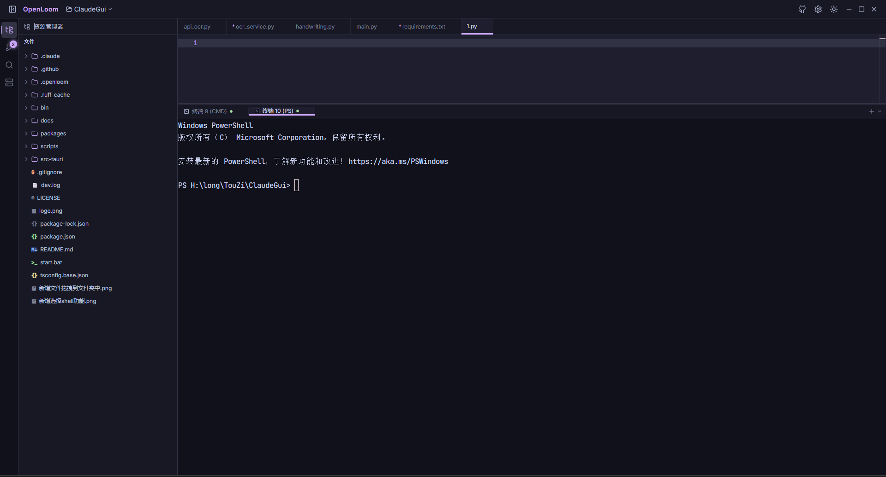
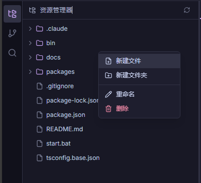
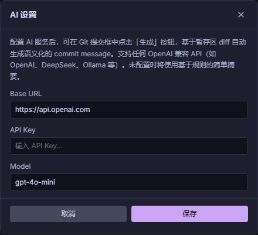
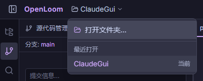

<div align="center">

# OpenLoom

### 编织你代码的 Web IDE

**AI 原生 · 轻量级 · 开源**

[](LICENSE)
[](README.md)

</div>

---

> "如果说 VS Code 是瑞士军刀，那 OpenLoom 就是那台织布机 —— 把编辑器、终端、Git、文件树，一根线全部织在一起。"

---

## OpenLoom 是什么？

OpenLoom 是一个**轻量级的 Web IDE**，为追求简洁、高效、一体化开发体验的开发者而生。

没有 Electron，没有臃肿。只有 Node.js 后端和 React 前端，紧密编织。

**从重要的事情开始，自信地交付。**

- 全功能 **Monaco 编辑器**（VS Code 同款引擎）
- 集成**终端**，真实 PTY 支持
- **文件树**，右键菜单支持新建、重命名、删除
- **Git 管理** —— 状态、暂存、提交、分支切换、提交图
- **全局搜索**（Ctrl+Shift+F）—— 跨项目文件内容搜索
- **快速打开**（Ctrl+P）—— 模糊匹配文件名，瞬间定位
- **Diff 审查** —— 审查 AI 生成的代码变更
- **深色/浅色主题** —— 内置 Catppuccin Mocha & Latte
- **工作区切换** —— 项目间无缝跳转

---

## 目录

- [快速开始](#快速开始)
- [功能特性](#功能特性)
- [快捷键](#快捷键)
- [技术栈](#技术栈)
- [项目结构](#项目结构)
- [参与贡献](#参与贡献)
- [开源协议](#开源协议)

---

## 快速开始

```bash
# 克隆仓库
git clone https://github.com/your-username/openloom.git
cd openloom

# 安装依赖
npm install

# 启动开发服务器
npm run dev
```

浏览器打开 `http://localhost:5173`，开始编织。

### Windows 快速启动

双击项目根目录的 `start.bat` —— 自动启动服务并打开浏览器。

### CLI 命令

全局安装 CLI 后，可以在任意位置打开项目：

```bash
# 链接 CLI（在项目根目录执行一次）
npm link

# 打开当前目录
openloom

# 打开指定项目
openloom /path/to/your/project
```

---

## 功能特性



### 编辑器

OpenLoom 的核心。基于 **Monaco Editor** —— VS Code 同款引擎。

- 50+ 语言语法高亮
- 智能提示与自动补全
- 多标签页，脏状态追踪
- Catppuccin Mocha（深色）& Latte（浅色）主题
- Ctrl+S 保存

### 文件树

一目了然的项目结构，不只是查看器 —— 更是完整的文件管理器。



- 右键菜单：**新建文件**、**新建文件夹**、**重命名**、**删除**
- 内联输入框，无弹窗，零摩擦
- WebSocket 监听外部文件变更，自动刷新
- 智能排序：文件夹优先，按名称排列

### 终端

真正的终端，不是玩具。通过 `node-pty` 提供完整 PTY 支持。

- 基于 WebSocket 的实时通信
- xterm.js + WebGL 渲染
- 自动适配面板大小
- 链接检测，可点击跳转

### Git 集成

Git 内置于侧栏，基础操作不再需要切换到终端。

- 文件状态总览（修改、新增、删除、未跟踪）
- 单文件暂存 / 取消暂存
- 输入消息提交
- 分支切换与创建
- 提交历史可视化图
- 提交 Diff 查看器

### 全局搜索（Ctrl+Shift+F）

在项目中找到任何内容。

- 跨所有项目文件的全文搜索
- 结果按文件分组，显示行号
- 关键词高亮
- 点击结果直接跳转到文件

### 快速打开（Ctrl+P）

以思维的速度导航代码库。

- 模糊文件名匹配
- 键盘导航（方向键 + 回车）
- 匹配字符高亮
- 最多显示 20 条结果，即时过滤

### Diff 审查

AI 写代码，你来决定留什么。

- 并排 Diff 查看器
- 逐文件接受或拒绝变更
- 批量接受 / 拒绝全部
- 基于 WebSocket 的实时文件快照

### AI 设置

一键配置 AI 服务，让 Git 提交信息自动生成。



- 支持任何 OpenAI 兼容 API（OpenAI、DeepSeek、Ollama 等）
- 配置 Base URL、API Key、Model
- 基于暂存区 diff 自动生成语义化 commit message

### 工作区切换

项目间无缝跳转，多项目开发不再手忙脚乱。



- 快速打开文件夹
- 最近打开项目列表
- 一键切换工作区

---

## 快捷键

| 快捷键 | 功能 |
|--------|------|
| `Ctrl+S` | 保存当前文件 |
| `Ctrl+P` | 快速打开文件 |
| `Ctrl+Shift+F` | 全局搜索 |
| `Ctrl+B` | 切换侧栏 |

---

## 技术栈

| 层级 | 技术 |
|------|------|
| 前端 | React 18, TypeScript, Tailwind CSS v4 |
| 编辑器 | Monaco Editor |
| 终端 | xterm.js + node-pty |
| 状态管理 | Zustand |
| 布局 | react-resizable-panels |
| 后端 | Express, Node.js |
| WebSocket | ws |
| 文件监听 | chokidar |
| Monorepo | npm workspaces |

---

## 项目结构

```
openloom/
├── packages/
│   ├── shared/          # 共享类型与常量
│   ├── backend/         # Express + WebSocket 服务端
│   │   └── src/
│   │       ├── api/     # REST API 路由
│   │       ├── ws/      # WebSocket 处理
│   │       ├── pty/     # 终端 PTY 管理
│   │       └── watcher/ # 文件系统监听
│   └── frontend/        # React 单页应用
│       └── src/
│           ├── components/
│           │   ├── editor/     # Monaco 编辑器
│           │   ├── filetree/   # 文件树 + 右键菜单
│           │   ├── git/        # Git 面板 + 提交图
│           │   ├── layout/     # 应用外壳 + 侧栏
│           │   ├── search/     # 全局搜索面板
│           │   ├── quickopen/  # 快速打开对话框
│           │   ├── terminal/   # 终端面板
│           │   └── workspace/  # 文件夹浏览器
│           ├── stores/         # Zustand 状态管理
│           └── themes/         # Catppuccin 主题
└── package.json
```

---

## 参与贡献

OpenLoom 是开源项目，欢迎贡献。

1. Fork 本仓库
2. 创建功能分支（`git checkout -b feat/amazing-feature`）
3. 提交变更（`git commit -m 'feat: add amazing feature'`）
4. 推送分支（`git push origin feat/amazing-feature`）
5. 发起 Pull Request

**贡献指南：**
- PR 保持聚焦 —— 一个 PR 只做一件事
- 遵循现有代码风格
- 提交前测试你的变更

---

## 开源协议

MIT License。详见 [LICENSE](LICENSE)。
